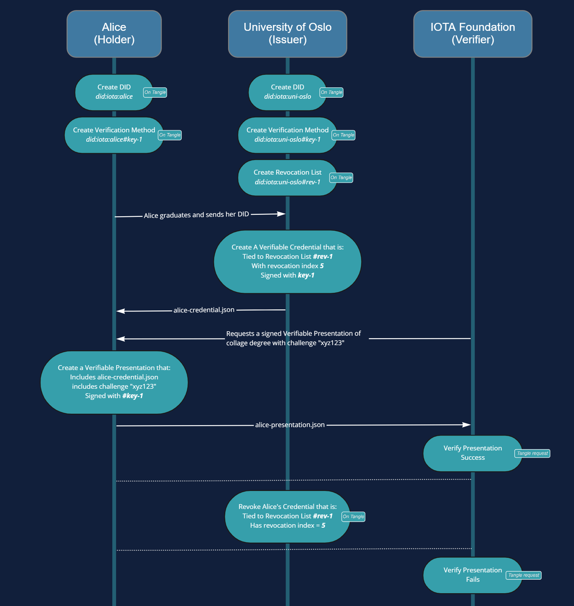

### IOTA indentity rust

https://github.com/iotaledger/identity.rs
https://wiki.iota.org/identity.rs/introduction

#### Decentralized Idenity

https://wiki.iota.org/identity.rs/decentralized_identity/


Decentralized Identity (DID) in IOTA refers to a digital identity that is stored on a decentralized ledger and controlled by the individual who owns the identity. In other words, a DID allows an individual to securely store and manage their personal information and digital assets in a way that is transparent, secure, and under their control.

In the context of IOTA, a DID can be used to represent a person, device, or organization and is stored on the Tangle, the distributed ledger technology that powers IOTA. A DID in IOTA can be used to securely store and manage a wide range of information and assets, such as personal information, credentials, and digital assets.

One of the key benefits of a DID in IOTA is that it provides a secure and transparent way for individuals to control their own digital identity, without relying on centralized entities. This helps to address many of the privacy and security concerns associated with centralized identity management systems.

Overall, decentralized identity is an important aspect of the vision for a more secure and privacy-preserving digital world, and IOTA's implementation of DIDs is a key part of this vision.

#### How does it work ?

A Decentralized Identity (DID) in IOTA works by creating a unique digital identity that is stored on the Tangle, the distributed ledger technology that powers IOTA.

The process of creating a DID in IOTA typically involves the following steps:

- <b>Generation of a private-public key pair</b>: This step involves generating a private key, which is kept secret, and a public key, which is used to identify the DID on the Tangle.

- <b>Creation of a DID document</b>: The DID document is a <b>JSON-LD</b> document that contains information about the DID, such as its public key, authentication methods, and service endpoints. The document is signed with the private key and stored on the Tangle.

- <b>DID Resolution</b>: When a user wants to access their DID, <b>they can use a DID resolver to retrieve the DID document from the Tangle</b>. The resolver uses the DID to look up the associated document and returns it to the user.

- Authentication and Verification: To authenticate and verify the DID, the user can use the public key stored in the DID document. This allows them to prove their identity and access their digital assets.

Overall, the process of creating and using a DID in IOTA is designed to be secure, transparent, and under the control of the individual. By using the Tangle as the underlying technology, IOTA provides a decentralized and trustless environment for DIDs, ensuring that individuals are in control of their digital identity and information.

##### JSON-LD 

JSON-LD (JavaScript Object Notation for Linked Data) is a lightweight, syntax for representing Linked Data in JSON format. 

Here is an example of this format in IOTA DID :

``` JSON
{
  "@context": "https://w3id.org/did/v1",
  "id": "did:iota:abcdefghijklmnopqrstuvwxyz1234567890",
  "publicKey": [{
    "id": "did:iota:abcdefghijklmnopqrstuvwxyz1234567890#keys-1",
    "type": "Ed25519VerificationKey2018",
    "controller": "did:iota:abcdefghijklmnopqrstuvwxyz1234567890",
    "publicKeyBase58": "abcdefghijklmnopqrstuvwxyz1234567890"
  }],
  "authentication": [{
    "type": "Ed25519SignatureAuthentication2018",
    "publicKey": "did:iota:abcdefghijklmnopqrstuvwxyz1234567890#keys-1"
  }],
  "service": [{
    "id": "did:iota:abcdefghijklmnopqrstuvwxyz1234567890;indx",
    "type": "IndxService",
    "serviceEndpoint": "https://indx.iota.org/"
  }]
}
```

#### DID Example

https://wiki.iota.org/identity.rs/tutorials/validate_university_degree/



Steps :
- Holder: Create a DID
- Issuer: Create a DID
- Issuer: Add a Verification Method
- Holder: Add a Verification Method
- Issuer: Create Revocation list
- Issuer: Create Verifiable Credential
- Holder: Create Verifiable Presentation
- Verifier: Verification
- Issuer: Revocation
