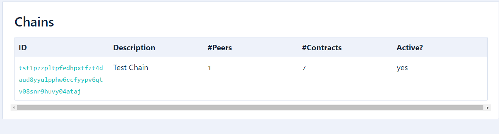

### How to deploy a ISC

- setup wasp-cli
    - go inside the local-setup folder located on wasp tools folder
    - create a basic default configuration with `wasp-cli init`
    - This command will create a configuration file named wasp-cli.json in the current directory
    - After this, you will need to tell the wasp-cli the location of the Hornet node and the committee of Wasp nodes
        ```bash
        wasp-cli set l1.apiaddress http://localhost:14265           // Hornet api
        wasp-cli set l1.faucetaddress http://localhost:8091         // Hornet Faucet

        wasp-cli set wasp.0.api http://localhost:9090               // Wasp

        ## You can add as many nodes as you'd like
        wasp-cli set wasp.1.api 127.0.0.1:9091
        ```
        Or is it doenst work you can add it directly to the `wasp-cli.json` file by adding this :
        ```json
        "l1": {
            "apiaddress": "http://localhost:14265",
            "faucetaddress": "http://localhost:8091"
        },
        "wasp": {
            "0": {
            "api": "127.0.0.1:9090",
            "nanomsg": "127.0.0.1:5550",
            "peering": "127.0.0.1:4000"
            }
        } 
        ```

    <b>OR</b>

    - use `docker exec  wasp /app/wasp-cli init`

<br>

- after wasp-cli was configured use `wasp-cli peering info` the result should look something like this :
```
PubKey: 0x108b0d8f4a0cc4933c01e87ac4bcc623159b74c1e00e3752f489f202c8cfda0a
NetID: 0.0.0.0:4000
```
<i>PubKey and NetID should be provided to other node operators. They can use this info to trust your node and accept communications with it.</i>

- then use `wasp-cli peering trust  0x108b0d8f4a0cc4933c01e87ac4bcc623159b74c1e00e3752f489f202c8cfda0a 0.0.0.0:4000`
- You should now see it on the trusted list with `wasp-cli peering list-trusted`
- to request fund use `wasp-cli request-funds`
- After you have requested the funds, you can deposit funds to a chain by running: `wasp-cli chain deposit IOTA:10000`
- you will then need to deploy your smart contract chain with : `wasp-cli chain deploy --quorum=1 --chain=testChain --description="Test Chain"` result should look like that : 
```
creating new chain. Owner address: 0x1cb02961695d160cfb1c52878234f04a6585fe8d27ebf17865d578bb3aeac7ce. State controller: 0xb7405753db3181cb91a67438277a34623e8a4b4fc4bc56f450ef648375d8812d, N = 1, T = 1
2023-02-12T23:50:21+01:00       INFO    nc      Posted blockID 0x7be80adf59790678b9ba1cbef838b2209399d4f06a3cd2d55b421d409e83d082
2023-02-12T23:50:21+01:00       INFO    nc      Posted transaction id 0x4e87d27dce160b779800c238e0bdb9d9401929ae1581f9caef501cd4a8f20054
2023-02-12T23:50:21+01:00       INFO    nc      Posted blockID 0xd9c3460799705738f95d45ee965b82549ec94eeb8648aa75cfdaef0eaa95a296
2023-02-12T23:50:21+01:00       INFO    nc      Posted transaction id 0xa03a997a75759bfc87d907ce4a9cb029c7687487c3a9421e585c1889edbeb7ca
creating chain origin and init transaction 0xa03a997a75759bfc87d907ce4a9cb029c7687487c3a9421e585c1889edbeb7ca.. OK
sending committee record to nodes.. OK
activating chain tst1pzzpltpfedhpxtfzt4daud8yyulpphw6ccfyypv6qtv08snr9huvy04ataj.. OK.
chain has been created successfully on the Tangle. ChainID: tst1pzzpltpfedhpxtfzt4daud8yyulpphw6ccfyypv6qtv08snr9huvy04ataj, State address: tst1qzm5q46nmvccrju35e6rsfm6x33razjtflztc4h52rhkfqm4mzqj69lx6qm, N = 1, T = 1
```
- You can now see the chain in the wasp dashboard in the chain section.


- you can now deploy a smart contract like this if you are on the folder where the wasm file is located : `wasp-cli chain deploy-contract wasmtime appenddid "My Append DID contract" ./did_append_contractwasm_bg.wasm`

